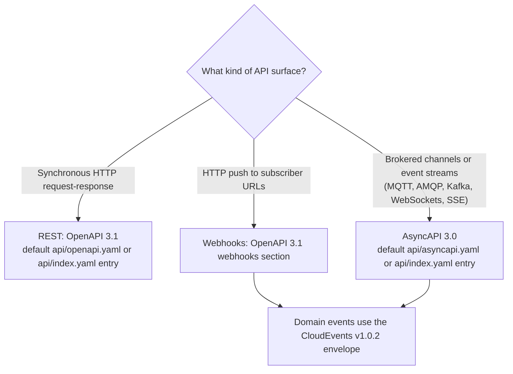
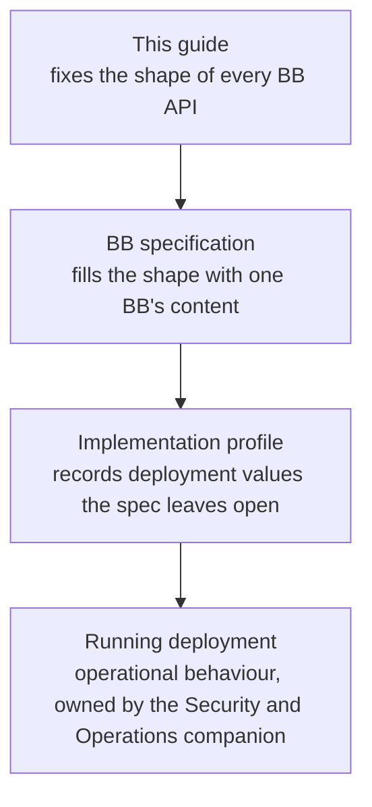

# 1. Introduction

## 1.1 Purpose 

This guide defines the cross-BB interface rules that make GovStack API specifications internally consistent, machine-validatable, and implementable from the spec alone.

## 1.2 Scope 

This guide constrains **what each BB's API specification declares**, and the **interface-level behavioural contract** that follows from it.

The test for inclusion: *would two BB editors writing two different specs need to agree on this for an integrator to consume both without per-BB glue?*

**In scope:**

- REST APIs over HTTP, documented in OpenAPI 3.1.
- Event payloads and metadata, standardised as CloudEvents across HTTP and non-HTTP transports.
- Event-driven APIs over brokered transports and event streams, documented in AsyncAPI 3.0 (MQTT, AMQP, Kafka, WebSockets, SSE).
- Webhook subscriptions, documented via OpenAPI 3.1 `webhooks` for HTTP push.
- The schema-only companion files `govstack-openapi-common.yaml` (`Problem`, `ValidationProblem`, `FieldError`, and `PageInfo`) and `govstack-asyncapi-common.yaml` (the reusable event envelope and transport-neutral asynchronous error schemas). OpenAPI reuse is optional; BBs keep security schemes, parameters, headers, responses, examples, and Operation resources local.
- The repository-level API inventory (`api/index.yaml`, when the default canonical paths are insufficient) and functional-requirement traceability file (`api/coverage.yaml`).

CloudEvents is the normative GovStack event contract across transports. It defines the common event envelope and stable event metadata (`id`, `source`, `type`, `time`, `data`, and extensions). AsyncAPI 3.0 is the required machine-readable documentation format for brokered event channels and event streams other than HTTP push webhooks: it describes channels, operations, messages, security, protocol bindings, examples, and delivery semantics. OpenAPI 3.1 `webhooks` remains the documentation format for HTTP push webhooks. Where AsyncAPI and CloudEvents overlap on event payload fields, CloudEvents takes precedence. GovStack domain events use structured CloudEvents JSON so the full event envelope is visible in the message payload and can be validated consistently across brokers. Protocol-specific depth for Kafka, MQTT, AMQP, WebSockets, and SSE is intentionally limited: BBs declare the relevant bindings where they affect the contract, while detailed broker-operation guidance belongs in the Security & Operations companion or a protocol profile. This reflects the current BB landscape being predominantly REST, not a judgement that the ecosystem should remain so.

The decision tree below summarises which artifact documents which kind of surface (informative). The document-level rules are in [§2](part-a/2-openapi-document-standards.md) and [§3](part-a/3-asyncapi-document-standards.md); the event rules are in [§16](part-d/16-cloudevents-and-webhooks.md) and [§17](part-d/17-asyncapi-channel-rules.md).

A BB MAY additionally expose surfaces under other industry standards (for example, an OGC API surface for spatial data, an OID4VCI surface for credential issuance, or an SDMX surface for statistical interchange). This is whole-surface adoption: the external standard governs that surface where it conflicts with this guide. [§1.7](#17-precedence-of-external-standards) covers the narrower case where an external standard or convention governs specific fields or envelopes inside a GovStack API surface. The guide's cross-cutting rules that do not conflict with the external standard still apply: [§8.6](part-b/8-headers.md#86-no-personal-data-in-addressable-locations) (no personal data in addressable locations), [§13](part-d/13-authentication-and-authorisation.md) (declaring a security scheme), [§11](part-c/11-errors.md) (a consistent error envelope where the external standard defines none), and [§18](part-d/18-compatibility-and-lifecycle.md) (versioning and deprecation). A surface is exempt from a specific rule only where the adopted standard actually governs that rule.

**Out of scope:**

- **Operational behaviour of a deployed BB** (token validation, certificate trust, key rotation, replay enforcement, audit logging, log redaction, alg allowlists, FAPI conformance, infrastructure). Belongs in a separate **GovStack API Security & Operations** companion (not yet drafted).
- **Ecosystem governance** (ratification, enforcement, exception lifecycle, transition timelines, conformance levels, companion-artifact ownership). Expected to be defined in the proposed **GovStack API Lifecycle & Governance** companion document, reconciled with the existing GovStack Specification Framework and CFR compliance model.
- Performance, SLOs, capacity planning.
- gRPC, GraphQL, file protocols, bulk media streaming.
- Implementation guidance for any specific BB.
- Design and maintenance of conformance test packs (separate companion artifact).

## 1.3 Relationship to existing GovStack documents 

This guide is a GovStack specification that extends the Cross-Functional Requirements. Under the GovStack Specification Framework an extending specification may tighten or elaborate a cross-functional requirement but **MUST NOT** contradict or weaken one, and a requirement classified IMMUTABLE cannot be altered at all. Where a rule here inherits a cross-functional requirement it cites the requirement identifier, for example `govstack-cfr-data#req-2` in [§10.2](part-c/10-data-types-and-formats.md#102-rfc-3339-timestamps), so that the inheritance and its immutability are visible at the point of use.

Where this guide overlaps with existing GovStack requirements or BB-specific conventions in ways that rule does not settle, precedence must be settled through ratification and reconciliation with the existing GovStack Specification Framework and CFR compliance model. A full reconciliation matrix will accompany v1.0.

## 1.4 Audience 

1. **Primary.** GovStack BB specification editors (the people writing the OpenAPI files).
2. **Secondary.** Implementers reading a BB specification to build a compliant system.
3. **Tertiary.** Country teams adopting BBs into a national architecture.

The guide is written for lookup, not end-to-end reading. Sections are self-contained where possible.

## 1.5 Language 

The guide uses RFC 2119 language: **MUST**, **MUST NOT**, **SHOULD**, **SHOULD NOT**, **MAY**. A MUST rule is mandatory for conformance. The companion Spectral ruleset enforces the machine-checkable subset; rules that require judgement are assessed through review and the conformance process. Each rule is tagged with an enforcement class ([§1.9](#19-rule-enforcement-classes)) that says which side of that line it falls on, and [§1.8](#18-layering-what-this-guide-constrains) says which layer it constrains. A SHOULD rule is expected by default and requires written justification to skip. A MAY rule is optional.

## 1.6 Exception process 

A BB editor **MAY** propose deviating from a **MUST** rule through the exception process to be defined in the proposed **GovStack API Lifecycle & Governance** companion document. An exception is effective only after approval and only for its recorded scope and lifetime. The canonical specification **MUST** declare each approved exception using the exact fields in [§20.3](part-e/20-conformance-and-validation.md#203-declared-guide-conformance-version); an expired entry or one with a missing or syntactically invalid exception record URI does not suppress a rule. The submission, review, renewal, public-log, and revocation workflow remains governance.

## 1.7 Precedence of external standards 

Where this guide adopts an external standard or convention on the OpenAPI 3.1, CloudEvents, or AsyncAPI 3.0 surface, that standard or convention takes precedence over the guide's generic rules for the fields or payloads it covers. The known precedences are:

- RFC 9457 fields inside error envelopes ([§11.1](part-c/11-errors.md#111-rfc-9457-problem-details); carve-out on [§9.2](part-c/9-json-conventions-and-naming.md#carve-out-from-92)).
- CloudEvents fields inside event envelopes ([§16.2](part-d/16-cloudevents-and-webhooks.md#162-cloudevents-envelope-required); carve-out on [§9.2](part-c/9-json-conventions-and-naming.md#carve-out-from-92)).
- IANA-registered values, notably JOSE and COSE algorithm and curve names and media types, wherever a BB enumerates them (carve-out on [§9.7](part-c/9-json-conventions-and-naming.md#carve-out-from-97)).
- RFC 8615 well-known URIs, whose location is fixed at `/.well-known/` and therefore outside the versioned path scheme ([§5.10](part-b/5-url-structure-and-versioning.md#510-standard-unversioned-endpoints)).
- OAuth 2.0 / OIDC field shapes inside tokens, claims, and discovery documents ([§13.2](part-d/13-authentication-and-authorisation.md#132-oauth-and-oidc-for-citizen-operations)).
- Code-list standards (ISO 3166-1, ISO 4217, BCP 47, E.164) inside their respective fields ([§10.5](part-c/10-data-types-and-formats.md#105-e164-phone-numbers)–[§10.10](part-c/10-data-types-and-formats.md#1010-iso-4217-currency-codes)).

Each precedence **MUST** be named explicitly at the rule it overrides. Beyond the list above, BBs are encouraged to adopt well-established external standards rather than reinvent shapes for problems those standards already solve; the precedence list will grow as such cases are recognised. A BB adopting a standard not yet listed **SHOULD** declare the precedence in its spec at the rule it covers, and **SHOULD** raise the adoption with the API Working Group so it can be added to the next guide revision and propagated to other BBs facing the same problem. Where the adoption conflicts with an existing MUST rule, the exception process ([§1.6](#16-exception-process)) is the formal path.

## 1.8 Layering: what this guide constrains 

This guide sits at the top of a stack, and keeping the layers distinct is what stops a design rule from drifting into an implementation decision:

- **This guide** fixes the *shape* of every BB API (the rules below). It is generic and binds the spec author.
- **A BB specification** (the OpenAPI/AsyncAPI document for one BB) fills that shape with concrete content: which resources, fields, status codes, scopes, and error names that BB has. The guide constrains the shape; the BB spec owns the content.
- **An implementation profile** records the concrete deployment values a spec deliberately leaves open: server URLs, identity-provider endpoints, replay windows, retry counts, retention periods. The guide never fixes these.
- **A running deployment** has operational behaviour (token validation, key rotation, replay enforcement, logging) that no specification expresses. That is the **GovStack API Security & Operations** companion's domain ([§1.2](#12-scope)).

A rule earns a place in this guide only if it constrains the specification document. Every rule is therefore one of three kinds:

1. **Spec-shape** rules constrain what the spec declares and are verifiable by reading the file (for example, [§9.2](part-c/9-json-conventions-and-naming.md#92-camelcase-field-names) camelCase, [§11.1](part-c/11-errors.md#111-rfc-9457-problem-details) `application/problem+json`).
2. **Documentation-obligation** rules require the spec to write down a contract whose value the guide does not itself fix (for example, [§14.3](part-d/14-idempotency.md#143-documented-replay-window), which makes the spec document its replay-window contract, and [§16.10](part-d/16-cloudevents-and-webhooks.md#1610-documented-delivery-failure-contract)).
3. **Behavioural-contract** rules state run-time behaviour an integrator relies on across BBs (for example, [§14.4](part-d/14-idempotency.md#144-replay-returns-original-response) idempotent replay, [§19.1](part-e/19-localisation.md#191-honour-the-request-language) honouring the request language). They are part of the interface contract but cannot be linted from the spec; they are verified by the conformance test pack ([Appendix A](appendix/a-companion-documents.md)).

What the guide does **not** do is mandate a concrete deployment value (an implementation profile's job) or operational behaviour (the Security & Operations companion's job). Where a section mixes the three kinds, a **Layer** note at the top of that section says which rules fall where.

This axis is orthogonal to the enforcement class of [§1.9](#19-rule-enforcement-classes). Spec-shape rules are usually `[M]` or `[M+R]`; behavioural-contract rules are `[R]`, because no linter can reach run-time behaviour, though the rule is no less binding and is still verified through conformance testing.

## 1.9 Rule enforcement classes 

Each numbered rule carries an enforcement-class tag, shown as a bold badge at the start of the rule text, that says how conformance is checked:

- **`[M]` Machine-checkable.** A linter (the GovStack Spectral ruleset, [§20.2](part-e/20-conformance-and-validation.md#202-passes-the-govstack-spectral-ruleset)) or a schema validator can verify the rule from the specification document alone. Conformance is mechanical and unambiguous.
- **`[R]` Review.** The rule requires human judgement; no reliable automated check exists. Conformance is assessed through specification review and the conformance process.
- **`[M+R]` Partly machine-checkable.** A linter can verify the structural part (presence, shape, naming, declared values), but a human reviewer must confirm the semantic part: whether the right construct was used for the right meaning.

The tag is guidance for the ruleset author and the conformance process, not part of the normative requirement: an `[M]` MUST and an `[R]` MUST are equally binding. The tag only marks where mechanical enforcement ends and review begins. Purely informative or scoping statements (for example [§12.10](part-c/12-pagination-filtering-sorting.md#1210-sparse-fieldsets-out-of-scope), [§16.9](part-d/16-cloudevents-and-webhooks.md#169-readiness-for-a-shared-signature-profile), [§18.6](part-d/18-compatibility-and-lifecycle.md#186-clients-ignore-unknown-fields)) carry no tag. The machine-checkable subset that [§20.2](part-e/20-conformance-and-validation.md#202-passes-the-govstack-spectral-ruleset) expects the Spectral ruleset to cover is the `[M]` rules plus the mechanical portion of the `[M+R]` rules. Enforceability of a rule may also depend on a referenced companion artifact, such as the conditional OpenAPI schema reuse in [§2.8](part-a/2-openapi-document-standards.md#28-conditional-vendored-openapi-schemas) or the AsyncAPI schemas in [§3.8](part-a/3-asyncapi-document-standards.md#38-pinned-vendored-asyncapi-components). Sequencing publication of those artifacts against the pilot and ratification plan is governance, not design.

## 1.10 Applicability and transition 

This guide applies in full to new API surfaces and to new major versions of existing surfaces. An already-published BB specification is not retroactively wire-incompatible merely because a newer guide exists. Existing surfaces **MUST** adopt requirements that do not change their public wire contract as soon as practical: canonical-file designation, `api/index.yaml` where needed, `api/coverage.yaml`, validation, complete metadata and descriptions, accurate examples, and security declarations that describe the behaviour already deployed. A change to paths, field names, representations, identifiers, status semantics, security behaviour, event addresses, or another consumer-visible contract **MUST NOT** be made in place solely to satisfy this guide; it **MUST** be released in the next major API version under [§18.4](part-d/18-compatibility-and-lifecycle.md#184-breaking-changes-bump-major-version). Until that major version, the existing surface documents the gap and follows the approved exception process rather than silently changing the wire contract.

The transition schedule, conformance levels, and enforcement dates for existing BBs are governance questions for the GovStack API Lifecycle & Governance companion ([Appendix A](appendix/a-companion-documents.md)). Every canonical specification pins the exact guide and ruleset versions it uses under [§20.3](part-e/20-conformance-and-validation.md#203-declared-guide-conformance-version); validation tooling **MUST NOT** silently substitute a newer compatible-looking version.

The guide itself follows SemVer, including the current exact prerelease identifier `0.1.0-draft`. A guide patch release **MUST NOT** change which specifications conform; it may only correct prose or tooling defects without changing normative meaning. A guide minor release **MAY** add optional guidance, deprecate a rule, or relax a requirement, but **MUST NOT** add or strengthen a mandatory requirement. Adding or strengthening a **MUST** or **SHOULD**, removing a permitted behaviour, or otherwise making a previously conforming specification non-conforming **MUST** increment the guide major version. These rules apply even during the `0.x` drafting series so that exact conformance declarations remain meaningful.
