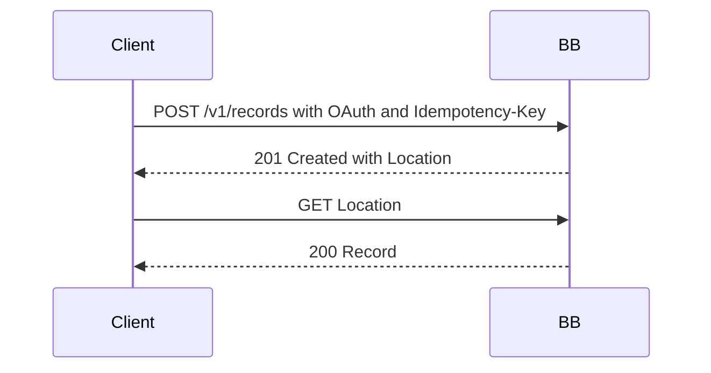
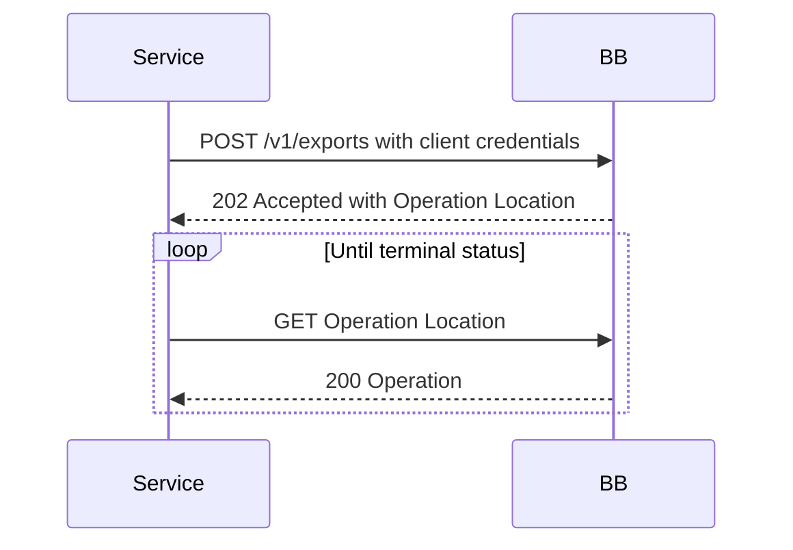

# 9 Internal Workflows

Describe externally observable sequences needed to understand a requirement.
Internal implementation steps are informative unless a requirement makes them
observable. Name the requirement IDs exercised by each workflow.

## 9.1 Create and retrieve a record

Requirement: `BB-TPL-FR-002`.

## 9.2 Request long-running work

Requirement: `BB-TPL-FR-003`.

